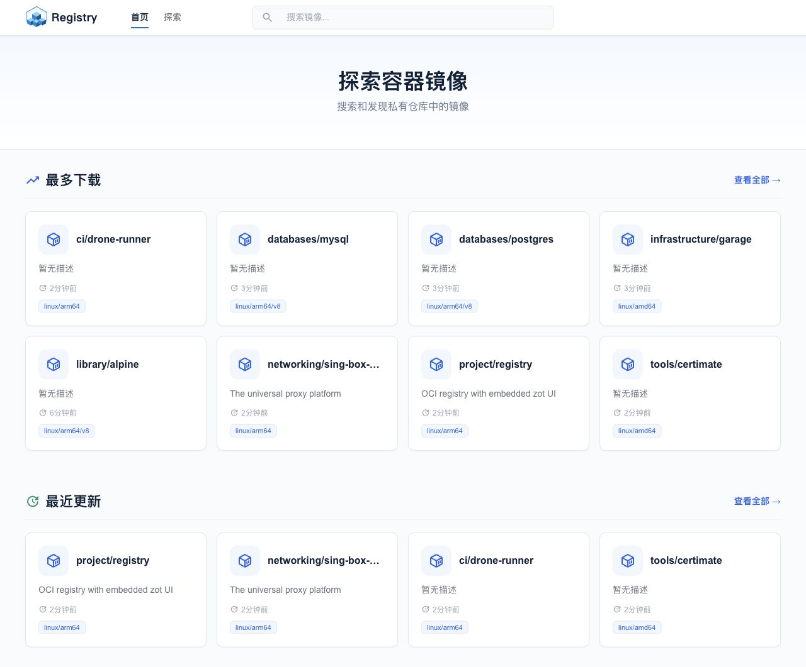
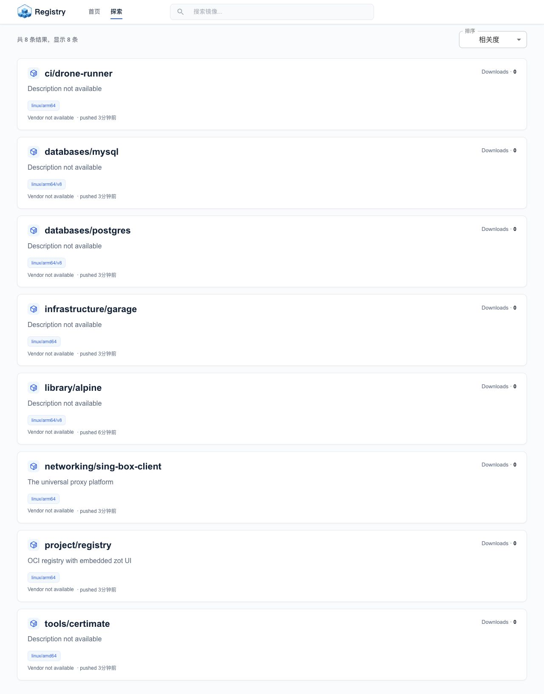
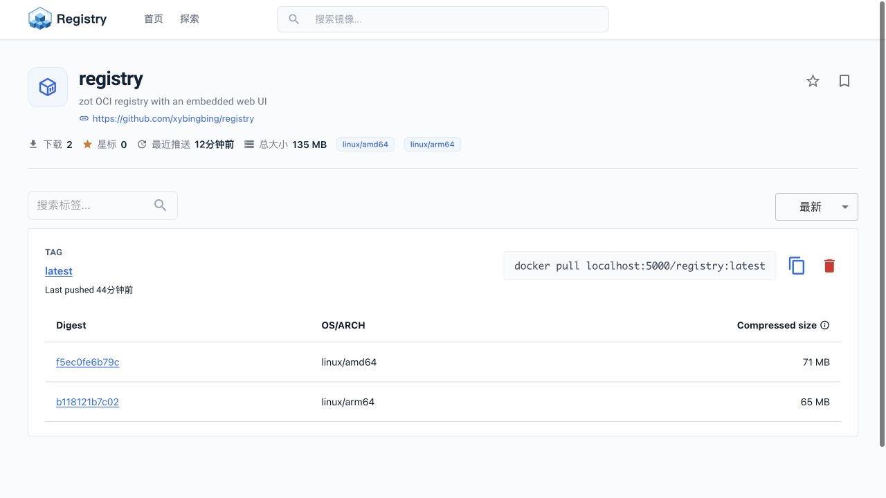

# Registry

基于 [zot](https://github.com/project-zot/zot) 构建的 OCI/Docker 镜像仓库，内置经过定制的 Web 管理界面。后端与前端通过多阶段 Docker 构建合并为一个镜像，可直接运行在 `linux/amd64` 和 `linux/arm64` 环境。

镜像地址：

```text
ghcr.io/xybingbing/registry:latest
```

## 界面预览

### 首页

首页展示常用仓库、最近更新、镜像描述和支持的平台。



### 镜像探索

通过搜索和排序快速浏览仓库中的镜像。



### 仓库详情

查看标签、Digest、操作系统、架构和压缩大小。拉取命令会自动带上当前访问的仓库地址。



## 主要功能

- 兼容 OCI Distribution Specification 和 Docker Registry API。
- zot 后端与 React 前端打包在同一个镜像中，无需单独部署 UI。
- 支持仓库搜索、标签列表、Digest、平台和镜像大小展示。
- 自动生成包含当前仓库域名和端口的 `docker pull` 命令。
- 支持 Docker Hub、Quay、GHCR 等上游仓库的按需同步。
- 支持按 `linux/amd64`、`linux/arm64` 等平台过滤同步内容。
- 使用单个多阶段 Dockerfile 构建前端、Go 服务端和最小运行镜像。
- 官方镜像同时发布 `linux/amd64` 和 `linux/arm64` 架构。

## 快速启动

启动仓库：

```bash
docker run -d \
  --name registry \
  --restart unless-stopped \
  -p 5000:5000 \
  -v registry-data:/var/lib/registry \
  ghcr.io/xybingbing/registry:latest
```

浏览器访问 [http://localhost:5000](http://localhost:5000)。

检查服务状态：

```bash
curl http://localhost:5000/v2/
```

## 推送和拉取镜像

向本地仓库推送 Alpine：

```bash
docker pull alpine:3.20
docker tag alpine:3.20 localhost:5000/library/alpine:3.20
docker push localhost:5000/library/alpine:3.20
```

从仓库拉取镜像：

```bash
docker pull localhost:5000/library/alpine:3.20
```

生产环境应为仓库配置 TLS 和身份认证。使用非 `localhost` 的 HTTP 地址时，还需要在 Docker daemon 中配置 insecure registry。

## 配置

镜像默认读取 `/etc/zot/config.json`。仓库数据保存在 `/var/lib/registry`。

使用项目中的配置文件启动：

```bash
docker run -d \
  --name registry \
  --restart unless-stopped \
  -p 5000:5000 \
  -v registry-data:/var/lib/registry \
  -v "$(pwd)/config.json:/etc/zot/config.json:ro" \
  ghcr.io/xybingbing/registry:latest
```

当前示例配置启用了：

- 搜索扩展和 Web UI。
- Docker Registry 兼容模式。
- Docker Hub、Quay、GHCR、GCR 和 Kubernetes Registry 的按需同步。
- `amd64` 和 `arm64` 平台过滤。

部署前请根据实际环境检查 [config.json](config.json) 中的同步源、超时、日志级别和存储目录。

## 按需同步

按需同步将本仓库作为上游镜像仓库的本地缓存使用。请求的镜像在本地不存在时，zot 根据请求域名选择上游、下载镜像并写入 `/var/lib/registry`，然后将镜像返回给 Docker 客户端。后续拉取同一个仓库和标签时会直接使用本地内容，不再重复下载上游镜像。

当前 `config.json` 配置了以下地址：

| 上游 | 上游镜像示例 | 本地拉取命令 |
| --- | --- | --- |
| Docker Hub | `docker.io/library/alpine:3.20` | `docker pull localhost:5000/library/alpine:3.20` |
| Quay | `quay.io/prometheus/busybox:latest` | `docker pull quay.localhost:5000/prometheus/busybox:latest` |
| GHCR | `ghcr.io/xybingbing/registry:latest` | `docker pull ghcr.localhost:5000/xybingbing/registry:latest` |
| GCR | `gcr.io/distroless/static-debian12:latest` | `docker pull gcr.localhost:5000/distroless/static-debian12:latest` |
| Kubernetes Registry | `registry.k8s.io/pause:3.10` | `docker pull k8s.localhost:5000/pause:3.10` |

Docker Hub 是默认上游，因此直接使用 `localhost:5000`。其他上游通过 `hostPrefix` 选择，例如请求 `k8s.localhost:5000` 时使用 `hostPrefix: "k8s"` 对应的 `registry.k8s.io`。

`hostPrefix` 属于域名，不属于镜像路径。拉取 Kubernetes 的 `pause` 镜像时应使用：

```bash
docker pull k8s.localhost:5000/pause:3.10
```

不要写成：

```text
localhost:5000/k8s/pause:3.10
```

### 同步过程

首次拉取一个尚未缓存的镜像时：

1. Docker 请求本地 zot 仓库。
2. zot 从请求域名的第一个标签取得 `hostPrefix`，例如 `quay.localhost` 对应 `quay`。
3. zot 在启用了 `onDemand` 的同步服务中选择匹配的上游。
4. zot 拉取符合 `content` 规则和平台过滤条件的清单与 Blob。
5. 同步内容写入本地存储，原始拉取请求随后正常返回。

当前配置只同步以下平台：

```text
linux/amd64
linux/arm64
```

即使本机只使用其中一个架构，首次同步也会缓存上游实际提供的这两个平台。Quay、GHCR、GCR 和 Kubernetes Registry 配置的单次同步超时为 10 分钟；失败时最多重试 3 次，重试间隔为 5 分钟。

可以实时查看同步日志：

```bash
docker logs -f registry
```

成功同步后查看本地仓库目录和标签：

```bash
curl http://localhost:5000/v2/_catalog
curl http://localhost:5000/v2/prometheus/busybox/tags/list
```

再次执行相同的 `docker pull`，输出应包含 `Image is up to date`，日志中也不会再次出现该镜像的上游同步过程。

### 生产环境域名

`*.localhost` 适合本地测试。生产环境假设仓库入口为 `registry.example.com`，需要为各同步源配置可解析到同一 zot 服务的域名：

```text
quay.registry.example.com
ghcr.registry.example.com
gcr.registry.example.com
k8s.registry.example.com
```

例如生产环境拉取 Kubernetes 镜像：

```bash
docker pull k8s.registry.example.com/pause:3.10
```

DNS、TLS 证书和反向代理必须覆盖这些域名。反向代理需要保留客户端原始 `Host` 请求头，否则 zot 无法识别 `hostPrefix`。使用 HTTP 或证书不受信任时，Docker daemon 还需要配置 insecure registry；生产环境建议始终使用可信 TLS 证书。

按需同步先检查本地仓库，再在缓存未命中时选择上游。不同上游如果使用完全相同的仓库名和标签，会命中同一份本地缓存，而不会按域名分别保存。需要严格隔离同名镜像时，应为对应同步规则配置不同的 `destination`，并在本地镜像路径中使用该目标前缀。

## 多架构构建

项目根目录只保留一个 [Dockerfile](Dockerfile)，包含三个构建阶段：

1. 使用 Node.js 和 pnpm 构建 `frontend`。
2. 将前端产物嵌入 zot，并针对目标架构编译 Go 二进制。
3. 将二进制和配置复制到 distroless 运行镜像。

创建并启用 buildx builder：

```bash
docker buildx create --name registry-builder --use
docker buildx inspect --bootstrap
```

构建并推送多架构镜像：

```bash
docker buildx build \
  --platform linux/amd64,linux/arm64 \
  --build-arg VERSION=v1.0 \
  --build-arg COMMIT="$(git rev-parse --short HEAD)" \
  --provenance=false \
  -t ghcr.io/xybingbing/registry:latest \
  --push .
```

`--provenance=false` 用于避免部分镜像仓库 UI 将 BuildKit provenance 显示为额外的 `unknown/unknown` 平台。

验证远端多架构清单：

```bash
docker buildx imagetools inspect \
  ghcr.io/xybingbing/registry:latest
```

## GitHub Actions 自动发布

[publish-image.yml](.github/workflows/publish-image.yml) 会使用 GitHub 提供的 `GITHUB_TOKEN` 登录 GHCR，并通过 Buildx 构建和推送 `linux/amd64`、`linux/arm64` 镜像，无需额外配置仓库密码。

- 推送到 `main`：发布 `v1.0`、`latest` 和 `sha-<commit>` 标签。
- 推送 `v*` Git 标签：发布对应版本标签和提交 SHA 标签。
- 在 Actions 页面手动运行：发布当前分支对应的镜像标签。

## 项目结构

```text
.
├── Dockerfile          # 前端、后端和运行镜像的多阶段构建
├── config.json         # 默认 zot 配置
├── frontend/           # React/Vite Web UI
├── pkg/                # zot 服务端核心代码与扩展
├── cmd/                # zot 命令入口
├── docs/images/        # README 界面截图
├── go.mod
└── Makefile
```

## 本地开发

前端开发：

```bash
cd frontend
corepack enable
pnpm install --frozen-lockfile
pnpm start
```

前端生产构建：

```bash
cd frontend
pnpm run build
```

完整镜像构建会自动完成前端构建和嵌入，无需手工复制 `frontend/build`。

## 数据持久化

请始终将 `/var/lib/registry` 挂载到 Docker volume 或持久化磁盘：

```bash
docker volume inspect registry-data
```

升级或迁移前应备份该数据卷以及实际使用的 `config.json`。

## License

本项目基于 zot 开发，遵循仓库中的 [LICENSE](LICENSE)。
